# Sleepy Farmer's Markets

An app built with Ruby on Rails by [David Baines](https://github.com/Bainezy94), [Jo Dunham](https://github.com/Rainbow-Ninja), and [Ewe Lin Loo](https://github.com/elloo).

**Live deployment:** https://sleepy-farmers-markets.herokuapp.com/

**GitHub:** [https://github.com/Bainezy94/TheFarmersMarket](https://github.com/Bainezy94/TheFarmersMarket)

## Project Description

### Problem Definition / Purpose

Farmer's markets are great places to find the best deals on fresh fruit and vegetables. The drawback? Sacrificing quality weekend sleep to squeeze through the tight crowds. Here's where **The Sleepy Farmer's Markets** comes in. With this two-sided marketplace, buyers are able to pick-up fresh produce AND enjoy sleeping past peak hours!

### Functionality / Features

##### For Buyers

- View all markets within the local vicinity.
- Order fresh food in advance to be picked up at a priority queue.
- View the current week's deals from local farmers.

##### For Farmers

- See a minimum demand for products in advance of physical trading hours.
- See total profits from online orders.

### Screenshots

### Tech Stack

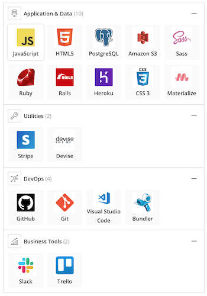

### Instructions 

To use the live deployment, go to: [https://sleepy-farmers-markets.herokuapp.com/home/page](https://sleepy-farmers-markets.herokuapp.com/home/page)

To use locally, perform the following steps in the CLI:

1. Clone the Git repository locally:
`git clone https://github.com/Bainezy94/TheFarmersMarket.git`

2. Move into the directory:
`cd TheFarmersMarket`

3. Install gems
`bundle install`

4. Ensure PostgreSQL is running and initialize the database:
`rails db:create`

5. Run migrations
`rails db:migrate`

6. (Optional) Seed the database
`rails db:setup`

7. Finally, open up a browser and go to http://localhost:3000

## Design

### Process

Our design process involved a few steps including:

1. Brainstorming session 
   - [Project and problem space ideation](#project-ideation)
   - [User stories](#user-stories)
   - [User journey/s diagram](#user-journey/s-diagram)
2. [Entity Relationship Diagram](#database-entity-relationship-diagrams)
3. [Wireframing](#wireframes)
4. [Moodboarding](#moodboards)
5. Creating a [Style guide](#style-guide)

### Project Ideation

Initially, we came up with several different ideas (as listed below). We settled on our final idea ("The Sleepy Farmer's Markets") by playing planning poker.

1. Handy Household Heroes / Gods 'n' Services

   Hero / mythological-themed labour hire for tasks such as dog walking, cleaning, gardening, removals / heavy lifting, carpentry, aquarium care, pool care, lawn mowing, tech support

2. Dumpster Divers Deals

3. Selling people's private data

4. Niche clothes

5. Carpooling

6. Baby stuff

7. Hardware hire

8. Collectible things

9. The Sleepy Farmer's Markets

   A service that allows you to beat the early times / tight crowds involved in shopping at farmer's markets. Alternative names include: Lazy FM, Sleepy FM, FM 4 Night Owls, Sleepy Sower Stalls / Shops / Stops.

### User Stories

- As Shania, I want to easily install the application so that I can create a marketplace for local produce
- As Greg, I want a professional, intuitive and approachable website associated with my goods so that customers feel confidence in my business.
- As Rachel, I want a no-nonsense approach to listing and displaying my products online so that I can sell more efficiently.
- As Jo, I want to order produce in advance from farmer's markets so that I don't have to get up at 5am.
- As Sarah, I want to have a receipt so that I have something to show when picking up my purchases and I can remember who my favourite farmer is.
- As Sue, I want to read and write reviews about other users - both buyers and farmers - so that I know who is reputable and trustworthy.
- As Kevin, I want to have an estimate of how much produce to bring to the markets every week so that I can plan in advance.
- As Bob, I want to view my order history so that I know which stores cater to my food allergies.
- As Reggie, I want an easy way to keep track of profits so that I can see the income from the website.

### User Journey/s Diagram

#### Sketches

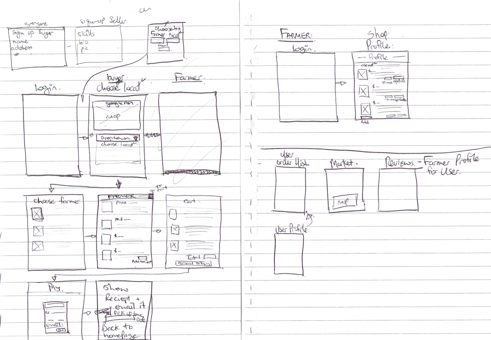

### Database Entity Relationship Diagrams

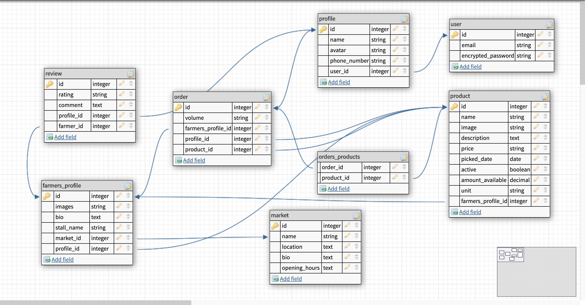

### Wireframes

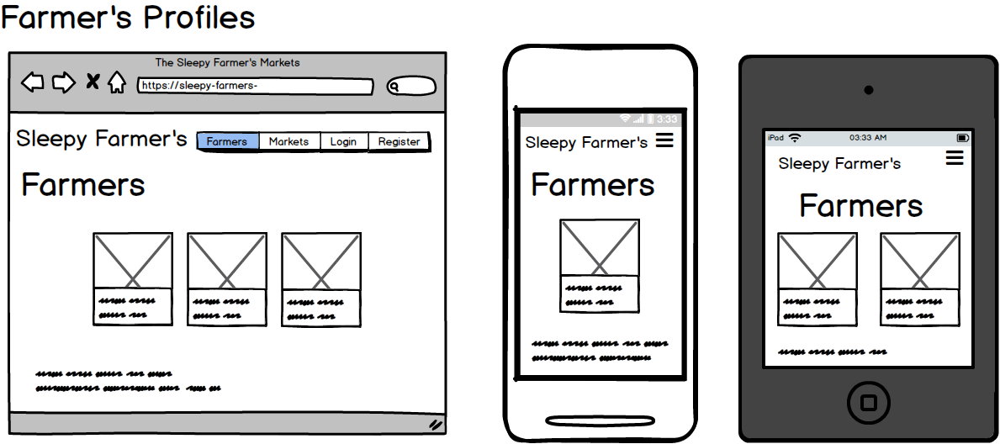

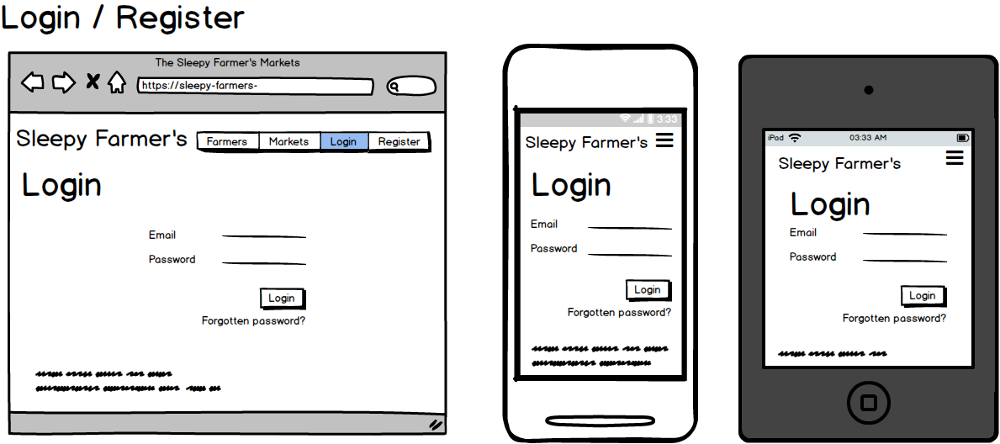

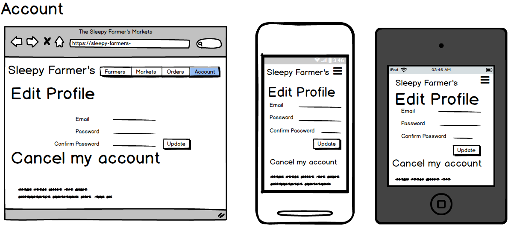

### Moodboards

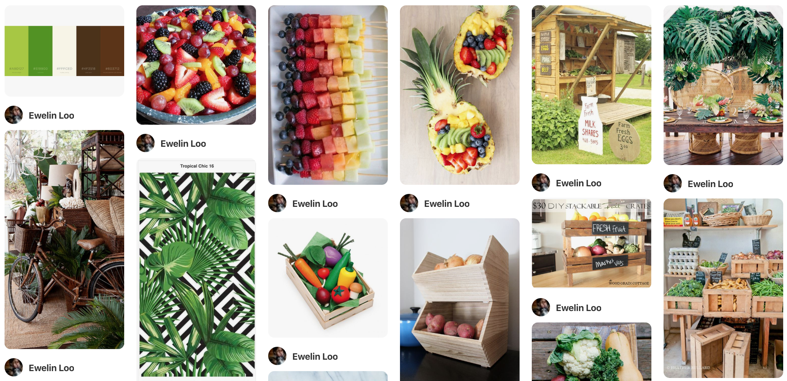
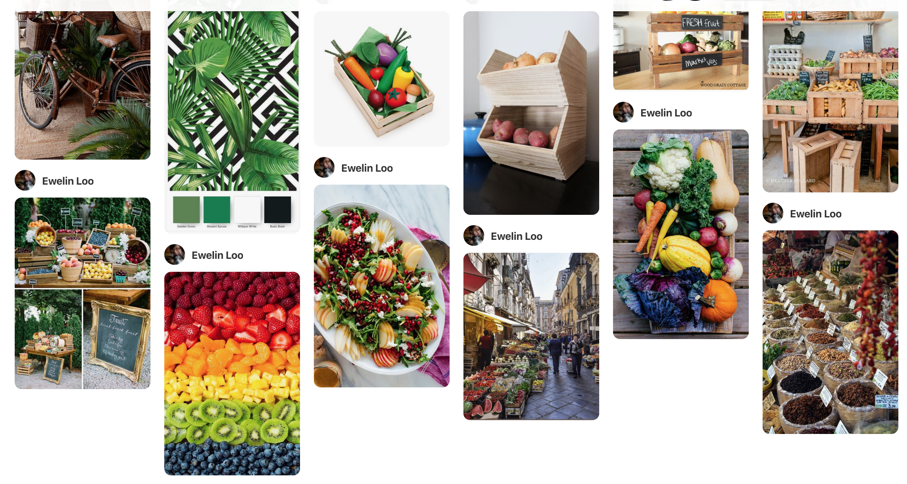

### Style Guide

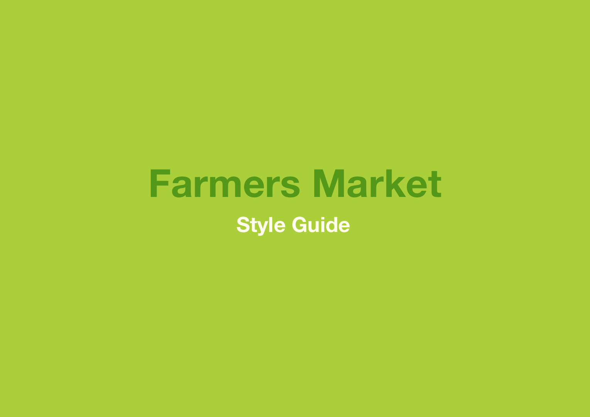
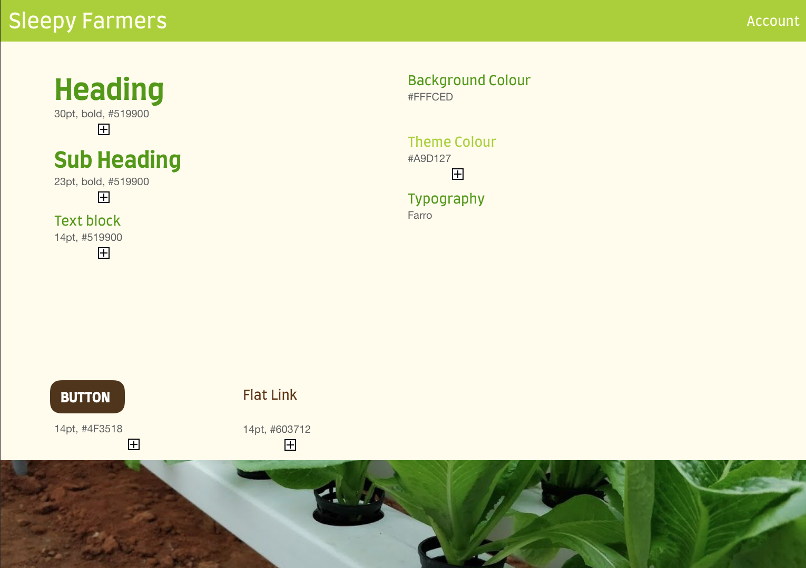

## Planning Process

### Project Plan & Timeline

#### Day 1: 23 July, 2019

- App ideation
- Basis of app (Models, scaffolding, etc)
- Mood board
- User stories
- Entity Relationship Diagrams
- Setup Trello
- Start documentation

#### Day 2: 24 July, 2019

- Update Trello with more user stories and different lists
- Lo-fi Wireframes
- Style guide
- Headings and marking criteria notes to documentation

#### Day 3: 25 July, 2019

- Profile and user login
- Farmer controllers and market selection
- Seed data for farmers and profiles

#### Day 4: July 26, 2019

- Fixed models
- Added drop-down menus for orders form
- Navbar styling and paths

#### Day 5: July 27, 2019

- Created feature for farmers to add produce to their stall
- Fixed more models issues

#### Day 6: July 29, 2019

- Added ERD to README.md
- Worked on backend: 
  - farmer_profile
  - Orders model
  - Create join table for orders_products
  - Dynamic form for orders
  - Seed data
- Worked on frontend: 
  - Added Materialize
  - Navbar and icons
  - Header and footer
  - Margins
  - Toasts

#### Day 7: July 30, 2019

- Integrated SimpleForm
- Setup storage bucket
- Updated order and product models
- Updated permissions on some buttons to only be visible when signed in
- Updated overall app styling
- Add Stripe button
- Added Geocoder gem
- Fixed seeds file

#### Day 8: July 31, 2019

- Styled forms for markets and produce
- Updated user model with role
- Updated permissions for farmers around produce
- Added roles data to seed file
- Configured Geocoder
- Installed active storage
- Added mood board to README.md

#### Day 9: August 5, 2019

- Completed maps functionality
- Completed product seed data
- Added permissions for several pages
- Worked on order form

#### Day 10: August 6, 2019

- Datepicker feature
- Products display on farmer's page

### Trello Screenshots

## Short Answer Questions

### 1. What is the need (i.e. challenge) that you will be addressing in your project?

There is a need to make shopping at local farmer's markets more appealing to a wider audience. This is because supermarket giants such as Coles and Woolworths occupy [72.5%](https://www.news.com.au/finance/business/retail/woolworths-and-coles-have-taken-over-australians-lives/news-story/344d02196373c4f960a0d0014613ac1c) of the grocery sector, yet only [20%](https://www.smh.com.au/national/shoppers-hunger-for--local-foods-at-supermarkets-20140626-zsnct.html) of consumers said the stores provided a good range. By promoting local farmer's markets, this project supports small Australian businesses and satisfies the consumer need for a wide range of local produce.

### 2. Identify the problem you’re trying to solve by building this particular marketplace *App*? Why is it a problem that needs solving?

Local farmer's markets offer fresh produce at excellent value however, they tend to be crowded and the best deals are sold out early. In addition, trading hours tend to be within a narrow window of time, typically only on Saturday or Sunday. These are problems that need solving as small businesses at local farmer's markets need more communal support in order to survive against dominant supermarkets. From a higher viewpoint, if the problems involved with shopping at a local farmer's market are not addressed, this could mean more reliance on the import of overseas produce. This could have implications for Australia's economy and political relations.

### 3. Describe the project will you be conducting and how your *App* will address the needs.

**The Sleepy Farmer's Markets** aims to broaden the range of consumers that farmer's markets and organic markets appeal to. Specifically, it targets people who are more likely to enjoy sleeping in than going out early on the weekends. Buyers simply need to login and place an order. This order is then set aside to be picked up before the market closes.

On the other side, farmers simply need to sign in and register a farmer profile. They are then able to list the amount of produce they will be bringing to the markets and what price they are selling for. The available amount shown to buyers is reduced every time an order is placed

### 4. Describe the network infrastructure the *App* may be based on.

Our app is hosted on Heroku using a postgres database. It has an AWS bucket to store uploaded images.

### 5. Identify and describe the software to be used in your *App.*

The software used in our app are: 
- HTML5 – setting up the structure of our website 
- CSS, SASS and  Materialize  - styling for the webpage
- Heroku – hosting our webapp 
- Postgres – our relational database 
- Google API – to map locations of markets
- JavaScript – used in conjunction with Google maps API to mark the farmers market locations 
- AWS – stores images uploaded by users 
- Ruby and Rails – what the entire app is written in 
- Stripe – payments and security around payments 
- Devise – authentication around logins

### 6. Identify the database to be used in your *App* and provide a justification for your choice.

PostgreSQL is the database we used We chose this over SQLite as our users can upload images and data as needed which, if using SQLite, would get very bulky, very quickly and slow down our app. PostgreSQL is also significantly larger allowing us to grow as a business. PostgreSQL also has many built in authentications and is easily scalable.

### 7. Identify and describe the production database setup (i.e. postgres instance).

We are using Heroku Postgres for production. We set our development environment prior to making it live and ran heroku commands to set up the database 

### 8. Describe the architecture of your *App*.

Shows almost flawless understanding of the high level structure of the app

### 9. Explain the different high-level components (abstractions) in your *App*.

Precisely explains and shows understanding of the different high-level components of the app

### 10. Detail any third party services that your *App* will use.

Includes a complete and detailed description of third party services used in the app

### 11. Describe (in general terms) the data structure of marketplace apps that are similar to your own (e.g. eBay, Airbnb).

Shows a complete understanding of the data structure of two sided marketplace apps

[Doorstep Organics](https://www.doorsteporganics.com.au/)

[Your Grocer](https://www.yourgrocer.com.au/)

[Coles](https://shop.coles.com.au/a/a-national/home)

### 12. Discuss the database relations to be implemented.

The following is our original plan, as depicted by the [ERD](#database-entity-relationship-diagrams) above: 

- We have markets which only admin can fill in (in order to be listed, markets could call up the admin and pay to be on the app.)
- Every person using the website needs a user and a profile (every user has one profile). 
  - From there, farmers have an extra farmers_profile as well. This allows them to upload their products. A farmer also signs up to be present at one market.
- Every profile can have many orders and each order can have many products.
- Each farmers_profile and profile can have many reviews left – so users can comment on good or bad farmers, and farmers can comment on whether users are reliable.

### 13. Describe your project’s models in terms of the relationships (active record associations) they have with each other.

In actuality, this is how we have implemented things:
- We have markets which only admin can fill in (markets could call up and pay to be on the app). Markets can have many farmers, and farmers_profile belongs to market.
- Every person using the website needs a user and a profile (every user has one profile, profile belongs to user). From there, farmers have an extra farmers_profile (farmers_profile belongs to profile, profile has one farmers_profile) 
- Farmers can upload many products (product belongs to farmers_profile, farmers_profile has many products). A farmer also signs up to be present at one market (belongs to market). There can also be many orders from a farmer (has many orders). Products belong to the farmers profile whom added it, and has and belongs to many orders
- Every profile can have many orders also (profile has many orders, order belongs to profile, order as belongs to farmers_profile). Each order can have many products and a product belongs to an order (order has and belongs to many products), although the way our orders are set up the user can only order one or more of the same product. Order also belongs to the profile making it and belongs to the farmers profile whom they are ordering from.
- Reviews although set up as far as the database, is not coded into the app so is currently not an option

### 14. Provide your database schema design.

Database schema design provided above under "Design". [Click here](#database-entity-relationship-diagrams) to view.

### 15. Provide User stories for your *App*.

User stories provided above under "Design". [Click here](#user-stories) to view.

### 16. Provide Wireframes for your *App*.

Wireframes provided above under "Design". [Click here](#wireframes) to view.

### 17. Describe the way tasks are allocated and tracked in your project.

We used a single [Trello](#trello-screenshots) board to organise, manage and keep track of all the tasks in our project. Within this Trello board, we associated each task card to a user story using a Power-Up called [Epic Cards by Screenful](https://screenful.com/epics-for-trello?utm_source=trello&utm_campaign=epics_powerup). We discussed the importance of each of these user stories and allowed this to direct our project plan.

We used a Trello list for our "User Stories" with the cards on this list in order of importance. Additional lists were used to organise our tasks into "To Dos", "Ongoing / Doing", and sprints of our completed tasks. Some tasks were further broken into sub-tasks using the Checklist feature - this allowed us to keep track of related sub-tasks with one task card. We used the Members feature of each task card to show who worked on what.

Overall, we broke down the entire project into the segments of "Frontend", "Backend" and "Documentation". Each group member was assigned to a different segment and the associated tasks for the entirety of the project. When required, we collaborated on one segment in order to complete sprints. Our progress was tracked and directed on a daily basis during our morning stand-up meetings.

### 18. Discuss how Agile methodology is being implemented in your project.

We used Agile methodology to guide our completion of **The Sleepy Farmer's Markets**. This was done by breaking our project into sprints so that each sprint covered one user story and its associated tasks.

Using incremental sprints encouraged us to constantly regroup every morning to discuss our progress. From these discussions, we were able to constantly ensure our attention was appropriately focused on completing the current sprint. Additionally, we were motivated by these sprints as they provided a small sense of accomplishment when completed. 

By the end of the project, we had completed __ sprints. The tasks completed within each sprint can be seen in the appropriate screenshot [here](#trello-screenshots). We aimed to fulfill our agreed upon high-priority user stories first so that we could quickly develop an MVP. The last __ sprints covered the remaining user stories, and testing.  

### 19. Provide an overview and description of your Source control process.

We used Git with GitHub for source control. 

[Branches](https://github.com/Bainezy94/TheFarmersMarket/branches) were used to carefully control the quality of our code. Each member of our team would use a separate branch to correspond with a separate feature. [Commits](https://github.com/Bainezy94/TheFarmersMarket/commits/dev) to the branch were pushed to the origin repo and pull requests to the "dev" branch were made on a daily basis, at minimum. Every pull request required a review from another member of the team.  

To address merge conflicts, we made sure to always pull code before we pushed. This meant that any conflicts were solved locally before being pushed to the remote repo.

Finally, pull requests were intermittently made from the "dev" branch to the "master" branch. This ensured that there was always a backup of our code that we could revert to.

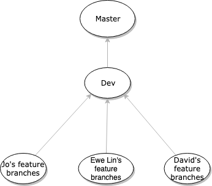

### 20. Provide an overview and description of your Testing process.

P - Basic general documentation about the types of testing that will be used and testing process

C - Meets P with description of specific test scenarios for some user stories and description of automated (unit) testing

D - Meets CR with tests implemented on code implemented thus far with results for tests executed thus far

HD - Meets D with tests documented or defined for all user stories, extensive use of unit testing on code completed thus far, and well organized test results

### 21. Discuss and analyse requirements related to information system security.

The Devise gem is great for password security and authentication.

The CanCanCan gem is excellent for managing CRUD and applying roles Admin has access to all CRUD, where as a user may only be able to have read rights and blocks users from seeing URLs they do not have permission to use.

P - Basic general documentation on information security requirements

C - Meets P with specific mention of requirements for this project, such as user authentication and protection of sensitive information

D - Meets CR with discussion of alternative options for information security and benefits/tradeoffs of each

HD - Meets D with evidence that the best option for information security was chosen

### 22. Discuss methods you will use to protect information and data.

We used devise for password authentication. We have also added roles that limit visibility for standard users. This isn’t a security feature so much as they could still access the pages if they knew the url. However from a superficial point of view, a standard user is unable to post, delete, or edit products like a farmer; or add markets like admin. Further farmers can only update their own products, not anyone elses.

P - Basic general documentation on methods to protect information and data

C - Meets P with specific design for implementing basic user login authentication for this project

D - Meets CR with discussion of alternative options for protecting information and data and benefits/tradeoffs of each

HD - Meets D with clear documentation on the specific methods that will be used for this project to protect information and data and why these methods were chosen

### 23. Research what your legal obligations are in relation to handling user data.

According to the Office of the Australian Information Commissioner, there are 13 [Australian Privacy Principles](https://www.oaic.gov.au/privacy/australian-privacy-principles/read-the-australian-privacy-principles/) that describe how user data and personal information must be handled. The areas that the pricinples cover and how these obligations can be met are as follows:

1. Open and transparent management of personal information

   Ideally, our app would have a clear, detailed and up-to-date privacy policy. An additional feature would be to use tooltips to explain briefly why certain pieces of data are required.

2. Anonymity and pseudonymity

   Our app should allow individuals the option of not identifying themselves or of using a pseudonym.

3. Collection of solicited information

   Ensure that no sensitive information is collected and only relevant data is retrieved from users.

4. Dealing with unsolicited personal information

	Check [guidelines](https://www.oaic.gov.au/privacy/australian-privacy-principles-guidelines/chapter-4-app-4-dealing-with-unsolicited-personal-information/) for how to deal with unsolicited personal information. 

5. Notification of the collection of personal information

   Notify or ensure individuals are aware of the matters outlined within the [guidelines](https://www.oaic.gov.au/privacy/australian-privacy-principles-guidelines/chapter-5-app-5-notification-of-the-collection-of-personal-information/).

6. Use or disclosure of personal information

   Ensure personal information is only used for the purposes that it was collected for.

7. Direct marketing

   Do not use user information for the purposes of direct marketing.

8. Cross-border disclosure of information

   Do not disclose user information to overseas entities.

9. Adoption, use or disclosure of government-related identifiers

   Do not adopt, use, or disclose government-related identifiers.

10. Quality of personal information

   Ensure that personal information collected remains accurate, up-to-date, and complete. This can be done through periodical emails or notifications on the marketplace. In addition, users are able to edit and update their own information through the "Account" tab at all times.

11. Security of personal information

    Protect personal information from misuse, interference and loss, and from unauthorised access, modification, or disclosure. This can be done with the assistance of an authentication gem such as Devise.

12. Access to personal information

    Allow users to access their personal information through the "Account" tab. This is accessible by all users when they are logged into the marketplace.

13. Correction of personal information

    As wih Principle 10, users should be allowed to edit and correct their own personal information through the "Account" tab, which appears when they are signed in.