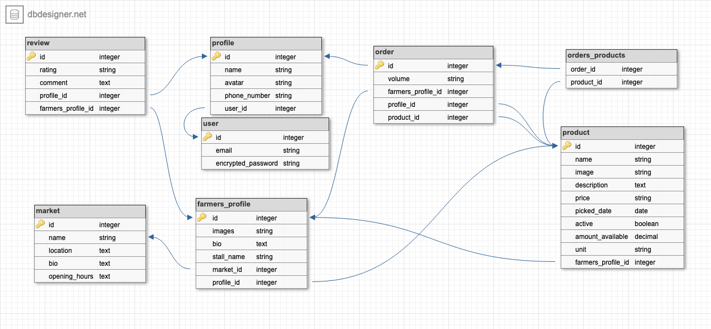

Sleepy Farmer's Markets

An app built with Ruby on Rails by [David Baines](https://github.com/Bainezy94), [Jo Dunham](https://github.com/Rainbow-Ninja), and [Ewe Lin Loo](https://github.com/elloo).

**Live deployment:** https://sleepy-farmers-markets.herokuapp.com/

**GitHub:** [https://github.com/Bainezy94/TheFarmersMarket](https://github.com/Bainezy94/TheFarmersMarket)

## Project Description

### Problem Definition / Purpose

Farmer's markets are great places to find the best deals on fresh fruit and vegetables. The drawback? Sacrificing quality weekend sleep to work through the tight crowds. Here's where **The Sleepy Farmer's Markets** comes in. With this app, buyers are able to pick-up fresh produce AND enjoy sleeping past peak hours!

### Functionality / Features

##### For Buyers

- Order fresh food in advance to be picked up at a priority queue

##### For Farmers

- See minimum demand for products in advance of sales periods
- See total profits from online orders

### Screenshots

### Tech Stack

- HTML, CSS, deployment platform, etc

### Setup

### Configuration

### Usage

## Design

### Process

Our design process involved a few steps including:

1. Brainstorming session 
   - [Project and problem space ideation](#project-ideation)
   - User stories
   - User journey/s diagram
2. [Entity Relationship Diagram](#database-entity-relationship-diagrams)
3. Wireframing
4. [Moodboarding](#moodboards)
5. Style guide

### Project Ideation

1. Handy Household Heroes

   Hero / mythological-themed labour hire for tasks such as dog walking, cleaning, gardening, removals / heavy lifting, carpentry, aquarium care, pool care, lawn mowing, tech support

2. Dumpster Divers Deals

3. Selling people's private data

4. Niche clothes

5. Carpooling

6. Baby stuff

7. Hardware hire

8. Collectible things

9. The Sleepy Farmer's Markets

   A service that allows you to beat the early times / tight crowds involved in shopping at farmer's markets. Alternative names include: Lazy FM, Sleepy FM, FM 4 Night Owls, Sleepy Sower Stalls / Shops / Stops.

### User Stories

### User Journey/s Diagram

### Database Entity Relationship Diagrams

D - ERD is complete with appropriately defined entities (models each serve a single purpose and appropriate fields). There may be a little duplication.

HD - Meets D with no duplication and ideal definition of entities.

D - All tables, fields, and relationships adequately represent an appropropriate solution.

HD - Meets D and represents a highly optimised solution.

Documentation provided demonstrates exceptional understanding of relational database model and database infrastructure.

HD - Identifies all significant entities, as well as additional entities

HD - Identifies all relationships / associations in a sophisticated relational model

HD - Designs a normalised schema (i.e. without data duplication) that facilitates extended functionality of the app

### Wireframes

### Moodboards

### Style Guide

## Planning Process

### Project Plan & Timeline

#### Day 1: 23 July, 2019

- App ideation
- Basis of app (Models, scaffolding, etc)
- Mood board
- User stories
- Entity Relationship Diagrams
- Setup Trello
- Start documentation

#### Day 2: 24 July, 2019

- Update Trello with more user stories and different lists
- Lo-fi Wireframes
- Style guide
- Headings and marking criteria notes to documentation

#### Day 3: 25 July, 2019

- Profile and user login
- Farmer controllers and market selection
- Seed data for farmers and profiles

#### Day 4: July 26, 2019

- Fixed models
- Added drop-down menus for orders form
- Navbar styling and paths

#### Day 5: July 27, 2019

- Created feature for farmers to add produce to their stall
- Fixed more models issues

#### Day 6: July 29, 2019

- Added ERD to README.md
- Worked on backend: 
  - farmer_profile
  - Orders model
  - Create join table for orders_products
  - Dynamic form for orders
  - Seed data
- Worked on frontend: 
  - Added Materialize
  - Navbar and icons
  - Header and footer
  - Margins
  - Toasts

#### Day 7: July 30, 2019

- Integrated SimpleForm
- Setup storage bucket
- Updated order and product models
- Updated permissions on some buttons to only be visible when signed in
- Updated overall app styling
- Add Stripe button
- Added Geocoder gem
- Fixed seeds file

#### Day 8: July 31, 2019

- Styled forms for markets and produce
- Updated user model with role
- Updated permissions for farmers around produce
- Added roles data to seed file
- Configured Geocoder
- Installed active storage
- Added mood board to README.md

#### Day 9: August 5, 2019

- Completed maps functionality
- Completed product seed data
- Added permissions for several pages
- Worked on order form

#### Day 10: August 6, 2019

- Datepicker feature
- Products display on farmer's page

### Trello Screenshots

## Short Answer Questions

### 1. What is the need (i.e. challenge) that you will be addressing in your project?

There is a need to make shopping at farmer's markets more appealing. These markets offer fresh produce at excellent value however, they tend to be crowded and the best deals are sold out early. 

### 2. Identify the problem you’re trying to solve by building this particular marketplace *App*? Why is it a problem that needs solving?

Demonstrates a full understanding of the problems that exist in a relevant marketplace that needs disrupting

### 3. Describe the project will you be conducting and how your *App* will address the needs.

### 4. Describe the network infrastructure the *App* may be based on.

Show a full understanding of the hosting infrastructure

### 5. Identify and describe the software to be used in your *App.*

Complete a detailed description of the software used in the app

### 6. Identify the database to be used in your *App* and provide a justification for your choice.

Full discussion of the database used, including an excellent assessment of the pros and cons of this type of database

### 7. Identify and describe the production database setup (i.e. postgres instance).

Gives a complete description of the database setup in production

### 8. Describe the architecture of your *App*.

Shows almost flawless understanding of the high level structure of the app

### 9. Explain the different high-level components (abstractions) in your *App*.

Precisely explains and shows understanding of the different high-level components of the app

### 10. Detail any third party services that your *App* will use.

Includes a complete and detailed description of third party services used in the app

### 11. Describe (in general terms) the data structure of marketplace apps that are similar to your own (e.g. eBay, Airbnb).

Shows a complete understanding of the data structure of two sided marketplace apps

[Doorstep Organics](https://www.doorsteporganics.com.au/)

[Your Grocer](https://www.yourgrocer.com.au/)

[Coles](https://shop.coles.com.au/a/a-national/home)

### 12. Discuss the database relations to be implemented.

Provides coherent discussion of the database relations, with reference to the ERD

### 13. Describe your project’s models in terms of the relationships (active record associations) they have with each other.

Complete discussion of the project’s models with an understanding of how its active record associations function

### 14. Provide your database schema design.

Database schema design provided above. [Click here](#database-entity-relationship-diagrams) to view.

~~Flawless,complex, complete, and well thought through ERDs provided~~

### 15. Provide User stories for your *App*.

User stories are well thought out, relevant, and comprehensively cover the needs of the app

### 16. Provide Wireframes for your *App*.

More than five detailed and well designed wireframes provided, for several different screen sizes (as required for the app)

### 17. Describe the way tasks are allocated and tracked in your project.

We used a single [Trello](#trello-screenshots) board to organise, manage and keep track of all the tasks in our project. Within this Trello board, we associated each task card to a user story using a Power-Up called [Epic Cards by Screenful](https://screenful.com/epics-for-trello?utm_source=trello&utm_campaign=epics_powerup). We discussed the importance of each of these user stories and allowed this to direct our project plan.

We used a Trello list for our "User Stories" with the cards on this list in order of importance. Additional lists were used to organise our tasks into "To Dos", "Ongoing / Doing", and sprints of our completed tasks. Some tasks were further broken into sub-tasks using the Checklist feature - this allowed us to keep track of related sub-tasks with one task card. We used the Members feature of each task card to show who worked on what.

Overall, we broke down the entire project into the segments of "Frontend", "Backend" and "Documentation". Each group member was assigned to a different segment and the associated tasks for the entirety of the project. When required, we collaborated on one segment in order to complete sprints. Our progress was tracked and directed on a daily basis during our morning stand-up meetings.

~~Shows significant planning for how tasks are planned and tracked, including a full description of the process and of the tools used~~

### 18. Discuss how Agile methodology is being implemented in your project.

We used Agile methodology to guide our completion of The Sleepy Farmer's Markets. Breaking down our workflow into incremental sprints allowed us to constantly regroup every morning to discuss our progress and our next tasks. From these discussions, we were able to redirect our attention to any remaining uncompleted parts of the current sprint, if needed. Additionally, we were motivated by these sprints as they provided a soft deadline and a small sense of accomplishment when met. 

By the end of the project, we had completed __ sprints. The tasks completed within each sprint can be seen in the appropriate screenshot [here](#trello-screenshots). Each sprint corresponded to a specific feature of our marketplace and spanned over one or two user journeys. We aimed to fulfill our designated high-priority user stories first so that we could quickly develop an MVP. The last __ sprints covered the remaining user stories, related features, and testing.   

 ~~Documents comprehensive plan for agile methodology, with extensive evidence of use~~

### 19. Provide an overview and description of your Source control process.

P - Basic documented plan for source control use and existing Git source control repository with some project files  

C - Meets P criteria and has README and gitignore with appropriate content

D - Meets CR criteria and documented plan or evidence for using multiple feature branches

HD - Meets D criteria and demonstrates frequent commits, merges and pull requests

### 20. Provide an overview and description of your Testing process.

P - Basic general documentation about the types of testing that will be used and testing process

C - Meets P with description of specific test scenarios for some user stories and description of automated (unit) testing

D - Meets CR with tests implemented on code implemented thus far with results for tests executed thus far

HD - Meets D with tests documented or defined for all user stories, extensive use of unit testing on code completed thus far, and well organized test results

### 21. Discuss and analyse requirements related to information system security.

P - Basic general documentation on information security requirements

C - Meets P with specific mention of requirements for this project, such as user authentication and protection of sensitive information

D - Meets CR with discussion of alternative options for information security and benefits/tradeoffs of each

HD - Meets D with evidence that the best option for information security was chosen

### 22. Discuss methods you will use to protect information and data.

P - Basic general documentation on methods to protect information and data

C - Meets P with specific design for implementing basic user login authentication for this project

D - Meets CR with discussion of alternative options for protecting information and data and benefits/tradeoffs of each

HD - Meets D with clear documentation on the specific methods that will be used for this project to protect information and data and why these methods were chosen

### 23. Research what your legal obligations are in relation to handling user data.

P - Basic research performed and basic understanding of legal obligations documented

C - Meets P with discussion of one way in which obligations can be met for this project (whether or not they are actually implemented)

D - Meets CR with discussion of alternate approaches to meet obligations and benefits/tradeoffs of each

HD - Meets D with evidence of discussion of findings and agreement on approach to be used to meet legal obligations